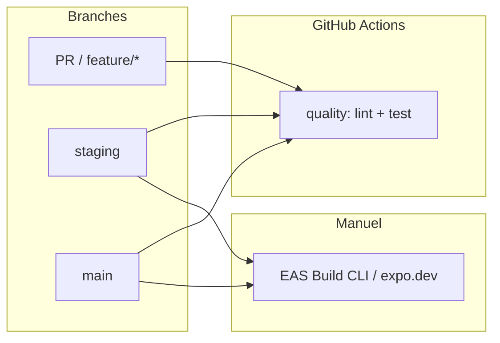

# LivSight Client — CI & builds EAS

Guide de référence : CI GitHub Actions (qualité) et builds EAS manuels.

**Dernière mise à jour :** 2026-07-29
**Repo :** `livSight/appClient`
**Stack :** Expo 56 · EAS Build · GitHub Actions

---

## 1. Vue d'ensemble


```mermaid
flowchart LR
  subgraph gh [GitHub Actions]
    Q[quality: lint + test]
  end

  subgraph branches [Branches]
    PR[PR / feature/*]
    ST[staging]
    MN[main]
  end

  subgraph manual [Manuel]
    EAS[EAS Build CLI / expo.dev]
  end

  PR --> Q
  ST --> Q
  MN --> Q
  ST --> EAS
  MN --> EAS
```

| Canal | Déclencheur | Action |
|-------|-------------|--------|
| **CI** | push, PR, `workflow_dispatch` | lint + tests uniquement |
| **Build EAS** | manuel (`npm run eas:build:*` ou dashboard Expo) | APK / AAB / IPA |

**Non automatisé (volontaire) :**
- Builds EAS sur push `staging` / `main`
- Soumission App Store / Play Store (`eas submit`)

---

## 2. Fichiers source de vérité

| Fichier | Rôle |
|---------|------|
| `.github/workflows/ci.yml` | Pipeline GitHub Actions (lint + test) |
| `eas.json` | Profils EAS (`development`, `preview`, `production`) |
| `app.config.js` | Variantes staging/prod (nom app, package Android, Firebase) |
| `app.json` | Config Expo de base (plugins, permissions, bundle id iOS) |
| `package.json` | Scripts `eas:build:*` pour builds manuels |

---

## 3. Pipeline GitHub Actions

Fichier : `.github/workflows/ci.yml`

### Déclencheurs

- `push` (toutes branches)
- `pull_request`
- `workflow_dispatch` (lancement manuel depuis l'onglet Actions)

### Job `quality`

1. Node **20**, `npm ci`
2. `npm run lint` (`expo lint`)
3. `npm test -- --ci --passWithNoTests` (Jest, tests sous `__tests__/**`)

Aucun secret GitHub requis pour la CI.

---

## 4. Profils EAS (`eas.json`)

### `development` (dev client local)

- **Usage :** dev client avec Metro (`npm run start:dev`)
- `developmentClient: true`
- Distribution interne, APK Android
- **Pas de variables gateway** dans `eas.json` → utiliser `.env` local

```bash
npm run eas:build:dev:android
npm run eas:build:dev:ios
npm run start:dev
```

### `preview` (staging — manuel)

| Variable | Valeur |
|----------|--------|
| `APP_VARIANT` | `staging` |
| `EXPO_PUBLIC_GATEWAY_URL` | `https://staging-gateway.livsight.com` |
| `EXPO_PUBLIC_ENABLE_PUSH` | `true` |

- Distribution : **internal** (lien de téléchargement EAS)
- Android : **APK**

```bash
npm run eas:build:preview:android
npm run eas:build:preview:ios
```

### `production` (stores — manuel)

| Variable | Valeur |
|----------|--------|
| `APP_VARIANT` | `production` |
| `EXPO_PUBLIC_GATEWAY_URL` | `https://gateway.livsight.com` |
| `EXPO_PUBLIC_ENABLE_PUSH` | `true` |

- Distribution : **store** — Android **AAB**, iOS **IPA**
- `autoIncrement: true` (build numbers gérés par EAS)

```bash
npm run eas:build:production   # Android + iOS
```

### Soumission stores

```bash
npx eas-cli submit --platform ios --latest
npx eas-cli submit --platform android --latest
```

Profil `submit.production` dans `eas.json` pour Android (track internal).

---

## 5. Variantes d'app (`app.config.js`)

`APP_VARIANT=staging` (profil `preview`) modifie la config au build :

| Champ | Production | Staging |
|-------|------------|---------|
| Nom affiché | livsight | livsight Staging |
| Package Android | `com.livsight.client` | `com.livsight.client.staging` |
| URL scheme | `livsight` | `livsight-staging` |

Les deux variantes Android peuvent être **installées côte à côte** sur le même appareil.

### Firebase Android (`google-services.json`)

- Fichier **gitignoré** → absent des builds EAS sauf secret.
- Secret EAS : `GOOGLE_SERVICES_JSON` (type file)

```bash
eas secret:create --scope project --name GOOGLE_SERVICES_JSON --type file --value ./google-services.json
```

---

## 6. Workflows courants

### Développer une feature

1. Push / PR → **lint + tests** (CI automatique)
2. Dev local : `npx expo run:ios` / `npx expo run:android` ou dev client EAS + `npm run start:dev`
3. Gateway locale via `EXPO_PUBLIC_GATEWAY_URL` dans `.env`

### Tester en staging

1. Merger dans `staging`
2. Build manuel : `npm run eas:build:preview:android`
3. Installer l'APK **livsight Staging** sur appareil test
4. Vérifier connexion à `staging-gateway.livsight.com`

### Livrer en production

1. Merger `staging` → `main`
2. Build manuel : `npm run eas:build:production`
3. Récupérer AAB/IPA sur [expo.dev](https://expo.dev)
4. Soumettre : `npx eas-cli submit --platform all --latest`

---

## 7. Commandes rapides

```bash
# Qualité (identique à la CI)
npm ci && npm run lint && npm test

# Builds locaux (simulateur / émulateur)
npx expo run:ios
npx expo run:android
npm run start:dev

# EAS (manuel)
npm run eas:build:preview:android
npm run eas:build:production
npx eas-cli submit --platform all --latest
```

---

## 8. Références

- [Expo EAS Build](https://docs.expo.dev/build/introduction/)
- [Expo EAS Submit](https://docs.expo.dev/submit/introduction/)
- `CLAUDE.md` — architecture app, env vars, commandes dev
- `README.md` — démarrage rapide
