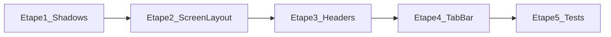

# iOS / Android UI parity — playbook LivSight

Guide pour rapprocher le rendu iOS et Android sur les apps Expo LivSight.  
Référence d’implémentation : **parcoursLivreur** (étapes 1–4 livrées ; étape 5 checklist manuelle).  
À rejouer sur **appClient** (et autres apps) dans le même ordre.

**Source plan :** `ios_android_ui_parity_126124d0.plan.md`  
**Dernière mise à jour :** 2026-07-24

**Enforcement Cursor :**
- Rule always-on : `.cursor/rules/ios-android-ui-parity.mdc`
- Skill portage (5 étapes) : `.cursor/skills/ios-android-ui-parity/SKILL.md`  
  → copier rule + skill (+ ce fichier) dans **appClient** pour le même comportement.

---

## Principes (non négociables)

- **Une étape = un lot de changes**, testée / validée, **puis** l’étape suivante.
- Déjà en place : `react-native-safe-area-context` + un layout d’écran central (`ScreenLayout` chez le livreur).
- **Interdit** dans ce chantier :
  - installer un second package Safe Area
  - `StatusBar.currentHeight`
  - `HEADER_HEIGHT` fixe / `utils/spacing.ts` dédié header
  - remplacer tous les `paddingTop` par la hauteur status bar
  - forcer Material Design sur iOS (respect HIG)

---

## Prérequis côté app cible (appClient)

Avant l’étape 1, vérifier :

1. `react-native-safe-area-context` installé et `SafeAreaProvider` au root.
2. Un composant type **ScreenLayout** (ou équivalent) qui applique `useSafeAreaInsets()` pour le **top** et le **bottom**.
3. Quasi tous les écrans `app/**` passent par ce layout.
4. Un token d’ombre de carte (`shadows.card` ou équivalent) consommé par les styles de cards partagés.

Si l’app client n’a pas encore de ScreenLayout unique : **ne pas** inventer SafeArea maison — d’abord centraliser le chrome d’écran, puis enchaîner les étapes ci-dessous.

---

## Étape 1 — Harmoniser les ombres de cartes (PRIORITÉ 1)

**Objectif :** cards proches iOS/Android sans changer la structure des écrans.

### Livreur — fait

Fichier : `theme/tokens.ts` — `shadows.card` via `Platform.select` :

| Plateforme | Style |
|------------|--------|
| **iOS** | ombre douce : `shadowOpacity: 0.06`, `shadowRadius: 8`, offset `{0, 2}` |
| **Android** | `elevation: 2` + `borderWidth: 1` + `borderColor: colors.cardStroke` |
| **default** | ombre iOS + `elevation: 2` |

`theme/styles.ts` → `card.base` spread `...shadows.card` (inchangé côté API).

### Actions sur appClient

1. Localiser le token / style d’ombre des cards.
2. Appliquer le même `Platform.select` (ajuster `cardStroke` au token couleur local).
3. Grep `shadowColor` / `elevation` **hors** token : n’aligner que le pattern « carte » (pas bulles chat / boutons login sauf si même pattern).

### Critère de done

- Accueil + liste type Conversations / Inbox : cards proches.
- Pas de régression iOS (ombre trop lourde).

**Hors scope :** Safe Area, tab bar, refactor écrans.

---

## Étape 2 — Audit ScreenLayout (tous les écrans)

**Objectif :** aucun padding status bar « maison » ; tout le chrome passe par ScreenLayout.

### Actions

1. Lister `app/**` **sans** ScreenLayout (re-exports tabs, wrappers, écrans spéciaux).
2. Pour chaque écran réel : confirmer ScreenLayout ; sinon l’ajouter.
3. Supprimer `paddingTop` / `marginTop` liés à la **status bar** (pas le padding interne 14/16 des cards).
4. Là où `useSafeAreaInsets` est local (chat, stock, formulaires) : **footer / clavier uniquement** — pas de double `paddingTop` safe area.

### Livreur — fait (résumé)

- Audit OK : écrans réels sous ScreenLayout.
- Footer formulaire : `MaDemandeProduitsForm` utilise `Math.max(insets.bottom, 12) + 16` dans le footer (pas de double top).

### Critère de done

- Inventaire documenté (même bref) + corrections.
- Aucun double safe-area top.

---

## Étape 3 — Headers custom hors ScreenLayout

**Objectif :** un header custom n’applique **pas** le safe-area top lui-même.

### Règle

- Safe-area top = **uniquement** ScreenLayout (`header` slot ou premier enfant sous layout).
- Zéro `StatusBar.currentHeight`.
- Commenter les headers partagés pour éviter une régression.

### Livreur — fait

- `CenteredScreenHeader` : doc — ne pas padding top ; toujours dans `ScreenLayout` `header`.
- `HomeTopBar` : safe-area géré par le slot `header` de ScreenLayout.
- `ajouter-au-stock` : header passé via `ScreenLayout` `header={…}`.
- Tabs `_layout` : `headerShown: false` ; pas de double inset top.

### Critère de done

- Grep `StatusBar.currentHeight` → 0 usage.
- Insets locaux seulement où nécessaire (footer / overlay).

---

## Étape 4 — Tab bar (`Platform.select` si écart visible)

**Objectif :** ajuster la tab bar seulement si l’écart reste visible après 1–3.

### Livreur — fait (`app/(tabs)/_layout.tsx`)

```ts
const bottomPad = Math.max(insets.bottom, Platform.OS === "android" ? 10 : 6);

tabBarStyle: {
  paddingTop: 6,
  paddingBottom: bottomPad,
  minHeight: 52 + bottomPad, // pas de height fixe (Dynamic Type)
  ...Platform.select({
    ios: { /* pas d’elevation Material */ },
    android: { elevation: 8 },
  }),
}
```

Labels via `AppText` `variant="dense"`.

### Critère de done

- Tabs alignés ; labels lisibles ; badge Inbox OK.

---

## Étape 5 — Checklist manuelle (à faire sur livreur + client)

Même comptes si possible, **iOS sim** + **Android émulateur/device** :

| Écran (livreur) | Équivalent client (adapter) | Vérifier |
|-----------------|-----------------------------|----------|
| Accueil `(tabs)/index` | Accueil | cards, header, safe top |
| Conversations / Inbox | Inbox / messages | cards, filtres, safe top |
| Détail course `transaction-detail/[id]` | Détail commande / livraison | header, cards, footer |
| Tab bar | Tab bar | hauteur, labels, badge |

Cocher ; noter écarts **acceptables** vs **à itérer**.

**Statut livreur :** étapes 1–4 done ; **étape 5 pending** (attendre validation visuelle Android maintenant que le build local tourne).

---

## Ordre d’exécution



---

## Fichiers livreur touchés (référence greppable)

| Étape | Fichiers |
|-------|----------|
| 1 | `theme/tokens.ts` (`shadows.card`), consommé par `theme/styles.ts` `card.base` |
| 2 | audit `app/**` ; ex. `components/MaDemandeProduitsForm.tsx` (footer `insets.bottom`) |
| 3 | `components/CenteredScreenHeader.tsx`, `components/HomeTopBar.tsx`, `app/ajouter-au-stock.tsx` |
| 4 | `app/(tabs)/_layout.tsx` |
| 5 | checklist manuelle (pas de diff code) |

---

## Portage appClient — checklist opérationnelle

1. [ ] Confirmer ScreenLayout + SafeAreaProvider
2. [ ] Étape 1 : `Platform.select` ombres cards + bordure Android
3. [ ] Valider Accueil + liste cards sur les 2 OS
4. [ ] Étape 2 : audit écrans sans layout / paddings status bar maison
5. [ ] Étape 3 : headers sans `StatusBar.currentHeight` ; top inset via layout
6. [ ] Étape 4 : tab bar `insets.bottom` + `minHeight` + elevation Android seule
7. [ ] Étape 5 : checklist manuelle miroir (écrans client)

Copier les snippets livreur en les adaptant aux noms de tokens / composants du client — ne pas importer Figma comme nouvelle spec visuelle.
